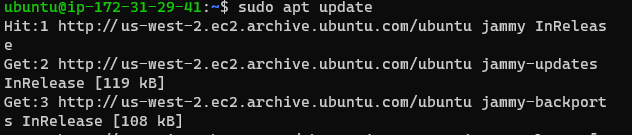

# DEPLOYING A LEMP STACK APPLICATION ON AWS CLOUD

A LEMP stack application is a web application that is built on top of the LEMP stack. The LEMP stack is an acronym that stands for Linux, Nginx, MySQL, and PHP. These are four open-source software technologies that are commonly used together to serve web applications. It is an alternative to the [LAMP Stack Application](https://github.com/collins-okafor/DevOps_Projects/blob/main/01.LAMP_STACK_IMPLEMENTATION/project1.md 'My github article on LAMP Stack deployment').

## Creating an Ubuntu EC2 Instance


#### Login into the instance using ssh


# STEP1 - Installing Nginx
Run a `sudo apt update` to download package information from all configured sources.



`sudo apt install nginx`


Spin up the nginx server and ensure it automatically starts on system reboot by running the following commands

```
sudo systemctl start nginx
sudo systemctl enable nginx
```

Run `sudo systemctl start nginx`


Accessing the default nginx web server block to see if everything works correctly. curl the local IP address of our local machine which in most case is 127.0.0.1 or the DNS name localhost on any web browser on our local machine.
curl http://127.0.0.1:80 or curl http://localhost:80

The below result shows nginx has been properly set up and we can deploy our web application.


Use `curl -s http://169.254.169.254/latest/meta-data/public-ipv4` command to retrieve your public IP address other than going to your aws console.

Check the URL in your browser. The following page will appear which shows that the web server is now correctly installed and accessible through your firewall.


# STEP2 - Installing MYSQL

We have succeeded in setting up our nginx webserver and ensured its accessible over the internet. Next is to install mySQL which is a relational database management server to help store data and manage content on our web application.

Run `sudo apt install mysql-server`


Run `sudo mysql`
This will connect to the MySQL server as the administrative database user root, which is inferred by the use of sudo when running this command. You should see output like this:


# STEP3 - Installing PHP

After Nginx have been installed to serve your content and MySQL installed to store and manage your data. Now we can install PHP to process code and generate dynamic content for the web server.

Run `sudo apt install php-fpm php-mysql`


# STEP4 - CONFIGURING NGINX TO USE PHP PROCESSOR

When using the Nginx web server, we can create server blocks (similar to virtual hosts in Apache) to encapsulate configuration details and host more than one domain on a single server. In this guide, we will use projectLEMP as an example domain name.

Create the root web directory for your_domain using the following command:

`sudo mkdir /var/www/projectLEMP`

Assign ownership of the directory with the $USER environment variable, which will reference your current system user using:

`sudo chown -R $USER:$USER /var/www/projectLEMP`

Then, open a new configuration file in Nginx’s sites-available directory using your preferred command-line editor. Here, we’ll use nano:

Write the following inside nano:


Use CTRL+X and then y and ENTER to confirm. When you're done typing.

Activate your configuration by linking to the config file from Nginx’s sites-enabled directory:

`sudo ln -s /etc/nginx/sites-available/projectLEMP /etc/nginx/sites-enabled/`

This will tell Nginx to use the configuration next time it is reloaded. You can test your configuration for syntax errors by typing:

`sudo nginx -t`


We also need to disable default Nginx host that is currently configured to listen on port 80, for this run

`sudo unlink /etc/nginx/sites-enabled/default`

When you are ready, reload Nginx to apply the changes:

`sudo systemctl reload nginx`

Your new website is now active, but the web root /var/www/projectLEMP is still empty. Create an index.html file in that location so that we can test that your new server block works as expected:

`sudo echo 'Hello LEMP from hostname' $(curl -s http://169.254.169.254/latest/meta-data/public-hostname) 'with public IP' $(curl -s http://169.254.169.254/latest/meta-data/public-ipv4) > /var/www/projectLEMP/index.html`

Now go to your browser and try to open your website URL using IP address:


# STEP 5 – TESTING PHP WITH NGINX

You can do this by creating a test PHP file in your document root. Open a new file called info.php within your document root in your text editor:

`sudo nano /var/www/projectLEMP/info.php`

Type or paste the following lines into the new file. This is valid PHP code that will return information about your server:

```
<?php
phpinfo();
```

You can now access this page in your web browser by visiting the domain name or public IP address you’ve set up in your Nginx configuration file, followed by /info.php:

`http://`server_domain_or_IP`/info.php`

You will see a web page containing detailed information about your server:


After checking the relevant information about your PHP server through that page, it’s best to remove the file you created as it contains sensitive information about your PHP environment and your Ubuntu server. You can use rm to remove that file:

`sudo rm /var/www/your_domain/info.php`

# STEP 6 – RETRIEVING DATA FROM MYSQL DATABASE WITH PHP (CONTINUED)

First, connect to the MySQL console using the root account:

`mysql -u root -p`

You will be prompt to enter the mysql root password you setted on STEP2

To create a new database, run the following command from your MySQL console:

```
mysql> CREATE DATABASE `example_database`;
```

Now you can create a new user and grant him full privileges on the database you have just created.

The following command creates a new user named example_user, using mysql_native_password as default authentication method. We’re defining this user’s password as password, but you should replace this value with a secure password of your own choosing.

```
CREATE USER 'example_user'@'%' IDENTIFIED WITH mysql_native_password BY 'password';
```

Now we need to give this user permission over the example_database database:

`mysql> GRANT ALL ON example_database.* TO 'example_user'@'%';`

Now exit the MySQL shell with:

`mysql> exit`

You can test if the new user has the proper permissions by logging in to the MySQL console again, this time using the custom user credentials:

`mysql -u example_user -p`

Notice the -p flag in this command, which will prompt you for the password used when creating the example_user user. After logging in to the MySQL console, confirm that you have access to the example_database database:

`mysql> SHOW DATABASES;`


Next, we’ll create a test table named todo_list. From the MySQL console, run the following statement:


`CREATE TABLE example_database.todo_list (item_id INT AUTO_INCREMENT,content VARCHAR(255),PRIMARY KEY(item_id));`

Insert a few rows of content in the test table. You might want to repeat the next command a few times, using different VALUES:

`mysql> INSERT INTO example_database.todo_list (content) VALUES ("My first important item");`

To confirm that the data was successfully saved to your table, run:

`mysql>  SELECT * FROM example_database.todo_list;`

You’ll see the following output


After confirming that you have valid data in your test table, you can exit the MySQL console:

`mysql> exit`

Now you can create a PHP script that will connect to MySQL and query for your content. Create a new PHP file in your custom web root directory using your preferred editor. We’ll use vi for that:

`nano /var/www/projectLEMP/todo_list.php`

Copy this content into your todo_list.php script:


Save and close the file when you are done editing.

You can now access this page in your web browser by visiting the domain name or public IP address configured for your website, followed by /todo_list.php:

`http://<Public_domain_or_IP>/todo_list.php`

You should see a page like this, showing the content you’ve inserted in your test table:

