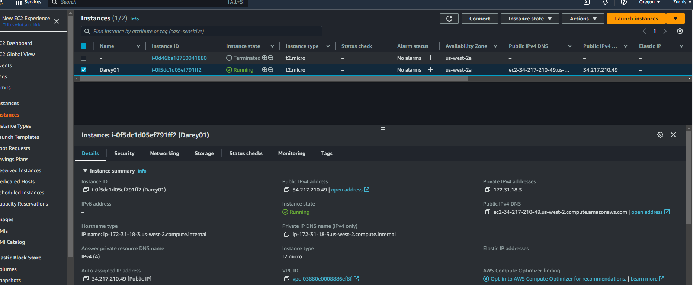
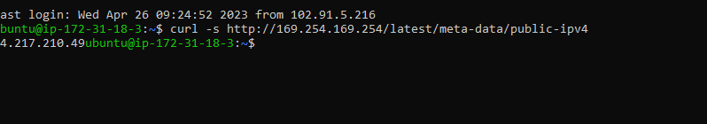
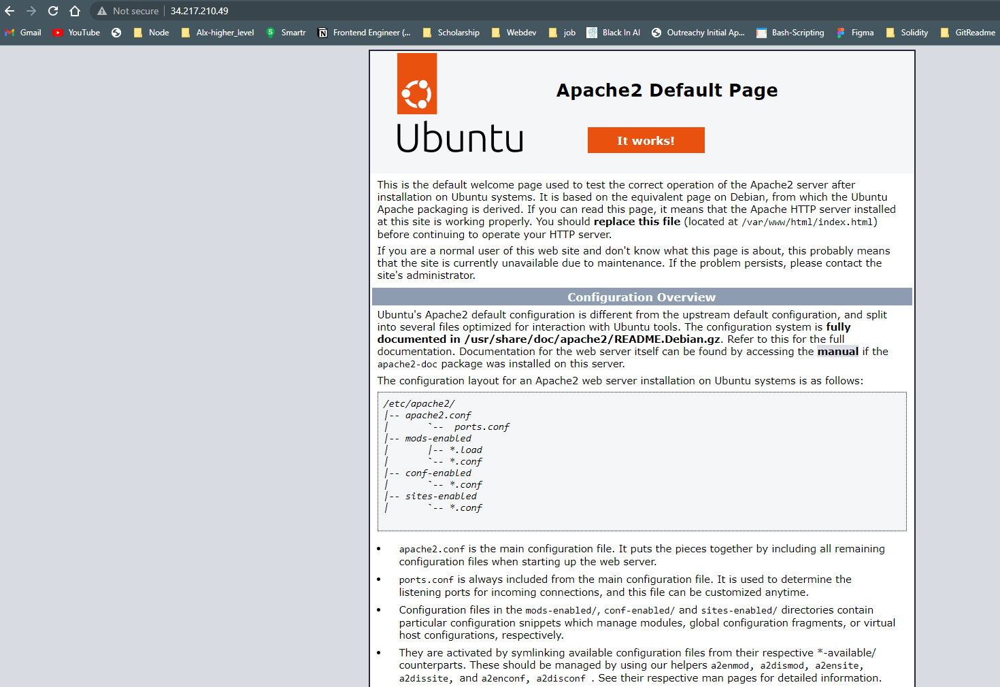
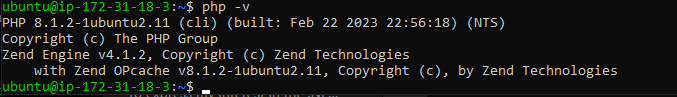
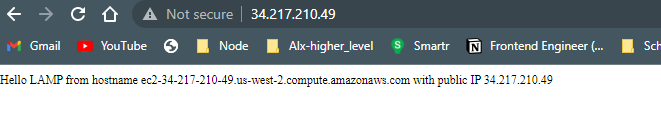
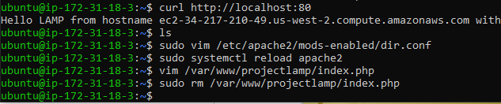
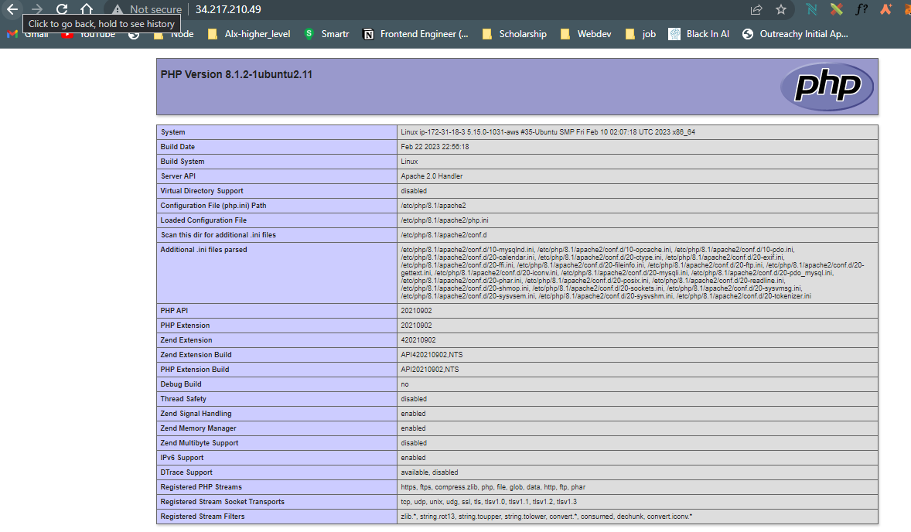

## DevOps Project 1

### Web stack implementation (lamp stack) in aws

---

### STEP1 - Installing Apache and updating firewall

---

### STEP2 - Installing MySQL

---

### STEP3 - Installing PHP

---

### STEP4 - CREATING A VIRTUAL HOST FOR YOUR WEBSITE USING APACHE

---

### STEP5 - ENABLE PHP ON THE WEBSITE

